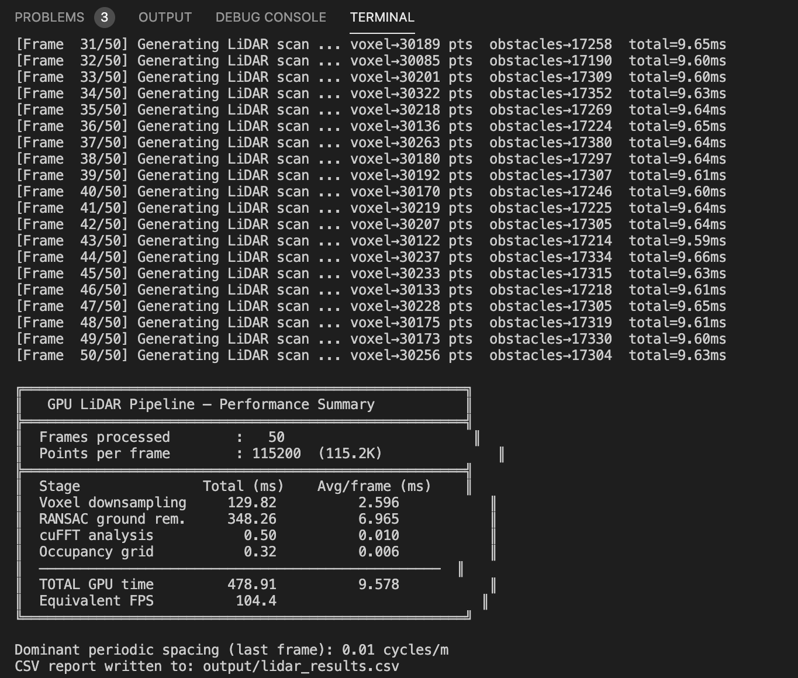

# GPU-accelerated LiDAR Perception Pipeline

This project implements a GPU-accelerated LiDAR perception pipeline for an autonomous driving system using:
 - CUDA kernels
 - NVIDIA GPU parallelism
 - cuFFT for signal processing
 - synthetic LiDAR sensor simulation

The overall goal is to simulate how a self-driving vehicle processes raw LiDAR scans in real time to reduce point cloud size, remove ground points, detect periodic structures and build a navigable occupancy map. 
 
The project mimics the perception stack of an autonomous vehicle. A LiDAR sensor mounted on a vehicle continuously emits laser pulses and measures distances to surrounding objects. The software pipeline takes these LiDAR returns and converts them into useful driving information.

# Code Execution

1. Run `./run.sh` script to execute the program

## Optional CLI Code Execution with arguments
Execute the commands below and pass the arguments number_of_frames and csv_results_file to `make run` command:

1. make clean
2. make build
3. make run ARGS="number_of_frames csv_results_file"

# Simulated LiDAR Sensor

This implementation synthetically generates LiDAR frames. A LiDAR frame is a collection of 3D points `(x, y, z)`. Each point represents where a laser beam reflected off an object. The function `generateLidarFrame()` creates a realistic autonomous driving environment. It simulates ground surface, moving vehicles, fence posts, background structures and sensor noise. The project simulates a Velodyne HDL-64E, which is a real industrial LiDAR sensor used in autonomous vehicles.

# Pipeline Overview

The pipeline contains 4 major GPU stages.

## Stage 1 — Voxel Grid Downsampling
LiDAR generates too many points. For example, 115,200 points per frame is expensive to process. The purpose of this stage is to reduce the number of points. The 3D world is divided into tiny cubes called voxels. Each voxel stores accumulated coordinates and number of points. All points inside the same voxel are replaced by a centroid. `Atomic operations` are adopted here. Since many threads may hit the same voxel simultaneously, atomic operations prevent race conditions.

## Stage 2 — Ground Plane Removal
Most LiDAR points belong to the road surface. The vehicle only cares about obstacles. This stage separates ground points from obstacle points.

## Stage 3 — cuFFT Frequency Analysis
The implementation uses `cuFFT` library for FFT processing. The FFT converts spatial domain to frequency domain. Over here, periodic structures create strong peaks. Example interpretation: Suppose fence posts occur every 3 meters. The FFT detects this periodic spacing and then the system outputs `dominantFrequency`. This can help autonomous systems identify road boundaries, barriers and repetitive structures.

## Stage 4 — Occupancy Grid
The purpose of this stage is to generate a 2D navigation grid or map. The Kernel `buildOccupancyGrid` converts each obstacle point `(x, y)` to grid cell and marks the cell as occupied. The occupancy grid is what the path planner uses. It tells the vehicle where obstacles exist and where it can drive safely.

## Output

Execution of the program results into a CSV file containing the per-scan execution timing, point counts and obstacle statistics.

